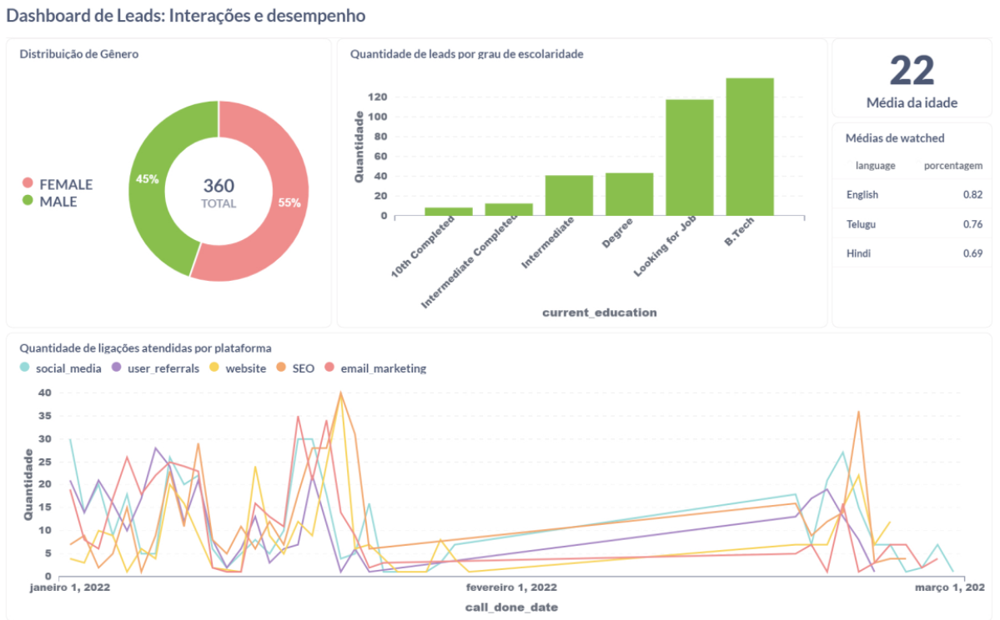

# Análise SQL para Aquisição e Retenção em Edtech

## Introdução
Este repositório contém análises em SQL sobre o crescimento de usuários em uma Edtech fictícia. O principal objetivo é identificar insights para otimizar a aquisição de clientes e impulsionar a expansão da base de usuários.

Este projeto de análise avalia o status atual da aquisição de clientes e identifica oportunidades de melhoria. Todas as consultas SQL e a criação do dashboard foram realizadas no Metabase, uma ferramenta de análise e visualização de dados que permite desenvolver dashboards interativos e compartilhar insights com a equipe.

## Estrutura do Repositório

- `data/`: Contém os dados em formato CSV utilizados para a análise.
  - `leads_basic_details.csv`
  - `sales_managers_assigned_leads_details.csv`
  - `leads_interaction_details.csv`
  - `leads_demo_watched_details.csv`
  - `leads_reasons_for_no_interest.csv`

- `queries/`: Contém as consultas SQL utilizadas para gerar os elementos gráficos no Metabase.
  - `01_distribuicao_genero.sql`
  - `02_media_idade.sql`
  - `03_distribuicao_educacao.sql`
  - `04_watched_percentage.sql`
  - `05_successful_calls.sql`

- `screenshots/`: Contém imagem do dashboard construído no Metabase.
  - `dashboard.png`

- `README.md`: Este arquivo de documentação.

## Tecnologias Utilizadas
- `Metabase`: Ferramenta de análise e visualização de dados.
- `SQL`: Linguagem para gerenciamento de bancos de dados relacionais.

## Informações dos Dados
Apresentação sucinta dos dados disponíveis na pasta [data](data).

### Tabelas Utilizadas
- **leads_basic_details**: Detalhes básicos dos leads
- **sales_managers_assigned_leads_details**: Detalhes dos leads atribuídos aos gerentes de vendas
- **leads_interaction_details**: Detalhes da interação com os leads
- **leads_demo_watched_details**: Detalhes das sessões de demonstração assistidas pelos leads
- **leads_reasons_for_no_interest**: Motivos declarados pelos leads para falta de interesse

## Execução da Análise

- **Passo a Passo para Executar as Queries SQL**:
   - Acesse o Metabase e navegue até a seção de consulta SQL.
   - Copie e cole as queries fornecidas na pasta [queries](queries).
   - Execute as queries dentro do respectivo banco de dados e visualize os resultados.

- **Exemplos de Queries e Seus Resultados**:
   ##### 1. Quantidade de Pessoas Masculinas e Femininas
     
   

   ##### 2. Média da Idade dos Leads
   
   

   ##### 3. Quantidade de Pessoas por Tipo de Graduação
   
   

   ##### 4. Médias de "Watched Percentage" Maior que 0.5, Agrupadas por "Language"
   
   
   
   ##### 5. Quantidade de Ligações Atendidas por Plataforma ao Longo do Tempo
   
   

## Visualização

#### Dashboard do Metabase

- O dashboard foi desenvolvido no Metabase e inclui visualizações interativas para cada uma das consultas mencionadas acima.

## Resultados e Discussão

- 🚻 **Gênero**: A predominância feminina (55%) sugere potencial foco em campanhas direcionadas a esse público.
  
- 🎓 **Tipo de Graduação**: A maioria dos leads possui uma formação técnica ou está em busca de oportunidades no mercado de trabalho. Isso indica que a empresa pode focar em oferecer cursos de capacitação técnica e programas que ajudem na empregabilidade dessas pessoas. A diversidade nos níveis de educação também sugere a necessidade de personalizar as ofertas.

- ⏳ **Idade**: A média de 22 anos aponta para um público jovem, sugerindo a necessidade de cursos voltados para iniciantes na carreira.

- 🖥️ **Sessões de Demonstração**: O alto engajamento (82%) em sessões em inglês reforça a importância de manter conteúdo nesse idioma.

- 💬 **Interações**: A variação nos atendimentos e os picos gerados por SEO destacam a eficácia de otimizações SEO e possíveis impactos de campanhas específicas durante janeiro e fevereiro.

